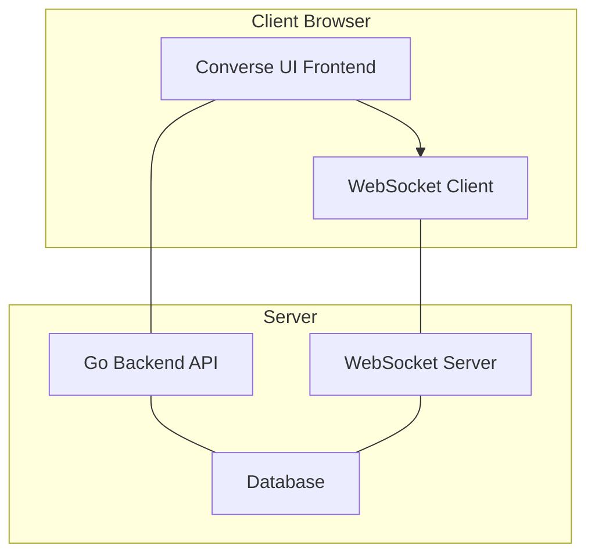

# System Architecture
Converse follows a client-server architecture with real-time communication capabilities through WebSockets. The system consists of two primary components:

*   **React Frontend**: Handles user interface, state management, and client-side WebSocket connections
*   **Go Backend**: Provides API endpoints, handles authentication, processes messages, and manages WebSocket connections

