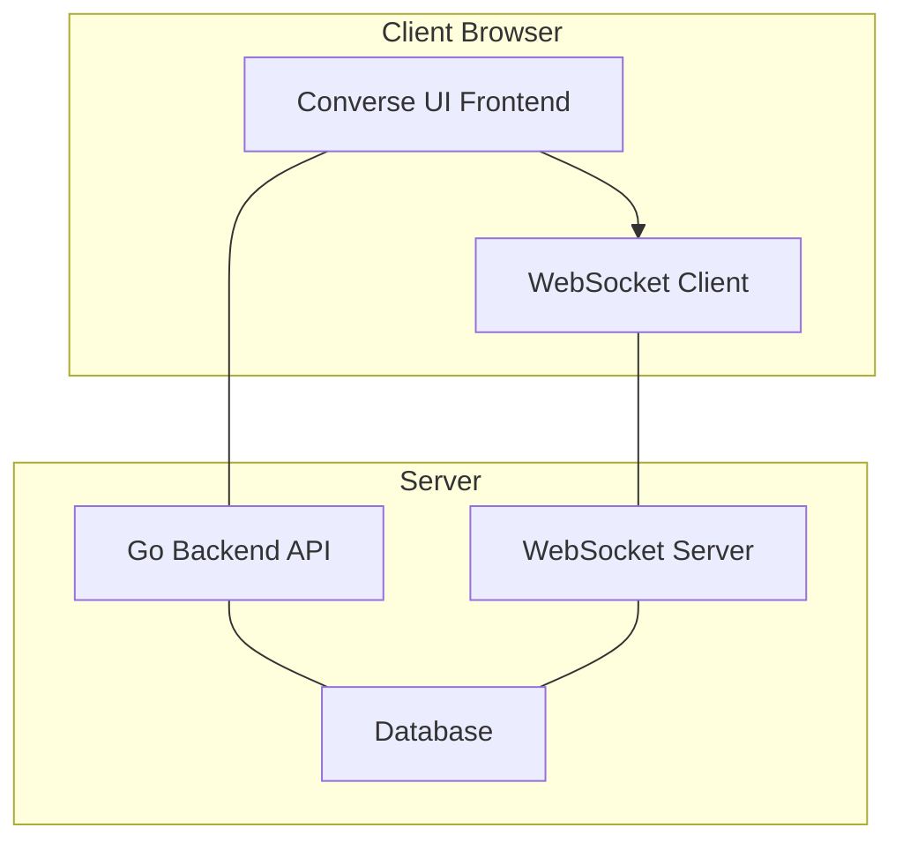
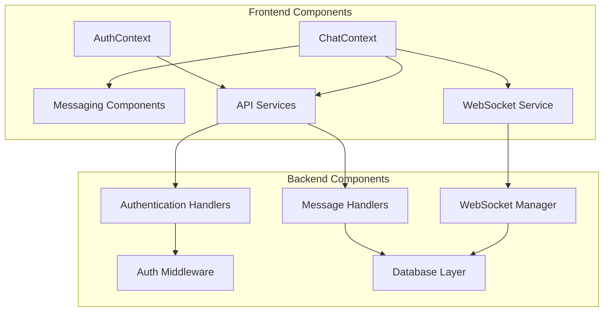
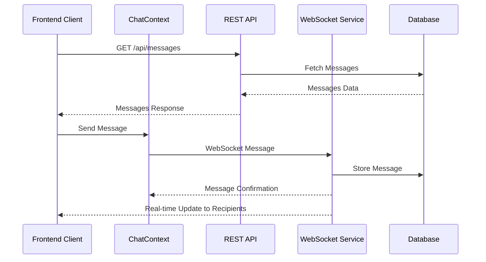
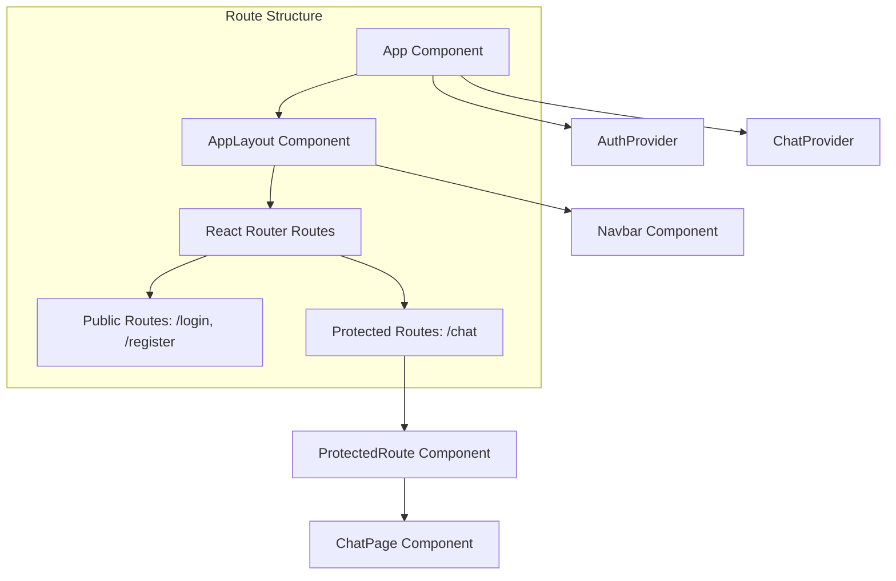

# System Architecture
Converse follows a client-server architecture with real-time communication capabilities through WebSockets. The system consists of two primary components:

*   **React Frontend**: Handles user interface, state management, and client-side WebSocket connections
*   **Go Backend**: Provides API endpoints, handles authentication, processes messages, and manages WebSocket connections



## Core Components
The system is composed of several interconnected components that handle different aspects of the application functionality:

### Frontend Components
*   **Authentication Context**: Manages user authentication state and tokens
*   **Chat Context**: Central state management for all chat-related functionality
*   **Messaging Components**: UI components for rendering conversations and messages
*   **WebSocket Service**: Handles real-time communication with the server

### Backend Components
*   **Authentication System**: Handles user registration, login, and JWT token management
*   **Message Handlers**: Processes message creation, retrieval, and storage
*   **WebSocket Manager**: Manages WebSocket connections and real-time message broadcasting



## Client-Server Communication
Converse utilizes two primary communication channels between client and server:

*   **REST API**: For authentication and data retrieval operations
*   **WebSockets**: For real-time messaging and notifications

### Authentication Flow
```mermaid
sequenceDiagram
    participant FC as Frontend Client
    participant AC as AuthContext
    participant RA as REST API
    participant DB as Database

    FC->>AC: Login Request
    AC->>RA: POST /api/auth/login
    RA->>DB: Verify Credentials
    DB-->>RA: User Data
    RA-->>AC: JWT Token
    AC-->>FC: Update Authentication State
    Note over FC, AC, RA, DB: Token stored in localStorage
```

### Messaging Flow


## WebSocket Implementation
The WebSocket system is a critical component enabling real-time communication between users. It handles:

*   Message delivery
*   Typing indicators
*   Online status updates

The WebSocket Manager, a key part of the backend, is responsible for:
*   Managing client connections
*   Broadcasting messages to specific users
*   Handling connection errors and reconnections

```mermaid
graph TD
    subgraph Frontend
        ChatContext --> WSService[WebSocket Service]
    end

    subgraph Message Types
        MTM[MessageTypeMessage]
        MTT[MessageTypeTyping]
    end

    subgraph Backend
        HWS[HandleWebSocket()] --> WSM[WebSocket Manager]
        WSM --> ClientStruct[Client Struct]
    end

    WSService -- Sends/Receives --> MTM
    WSService -- Sends/Receives --> MTT
    WSService --- HWS
```

## Application Structure

### Frontend Structure
The Converse UI is built with React and organized into the following main directories:

| Directory   | Purpose                                        |
|-------------|------------------------------------------------|
| /components | Reusable UI components                         |
| /context    | React context providers for state management   |
| /pages      | Main application pages and routes              |
| /services   | API and WebSocket service implementations      |
| /routes     | Routing and protected route implementation     |

The application uses React Context for state management, with two primary contexts:

*   **AuthContext**: Manages authentication state
*   **ChatContext**: Manages chat-related state



### Backend Structure
The backend is written in Go and follows a modular architecture:

| Directory         | Purpose                                  |
|-------------------|------------------------------------------|
| /internal         | Internal packages for the application    |
| /internal/auth    | Authentication and JWT handling          |
| /internal/handlers| HTTP API request handlers                |
| /internal/models  | Data models and database interfaces      |
| /internal/websocket| WebSocket implementation                 |

## Configuration
Converse uses environment variables for configuration, which are accessed through a central configuration file:

| Setting        | Purpose                                           |
|----------------|---------------------------------------------------|
| API_URL        | Base URL for backend API requests                 |
| WS_URL         | WebSocket server URL                              |
| AUTH_TOKEN_KEY | Key for storing authentication token in localStorage |
| USER_DATA_KEY  | Key for storing user data in localStorage         |

## User Interface
The Converse UI features a modern chat interface with the following key components:

*   Navigation bar with authentication controls
*   Sidebar displaying conversations and users
*   Chat window showing messages
*   Message input with typing indicators

The interface is built with a mobile-responsive design and themed with a green-blue color scheme.

## Summary
Converse is a full-featured chat application that demonstrates a modern web architecture with:

*   Separation of concerns between frontend and backend
*   Real-time communication via WebSockets
*   Stateful frontend with React Context
*   Secure authentication with JWT
*   Modular and testable components

This overview was generated using DeepWiki.
